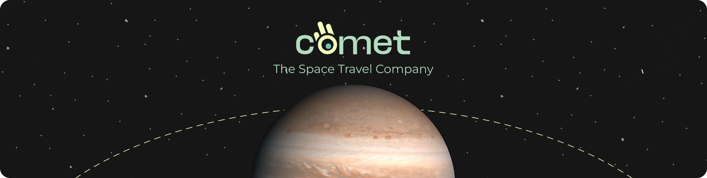
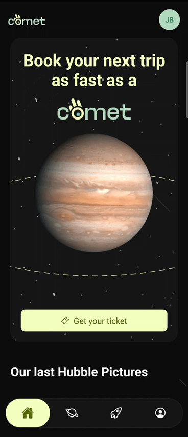
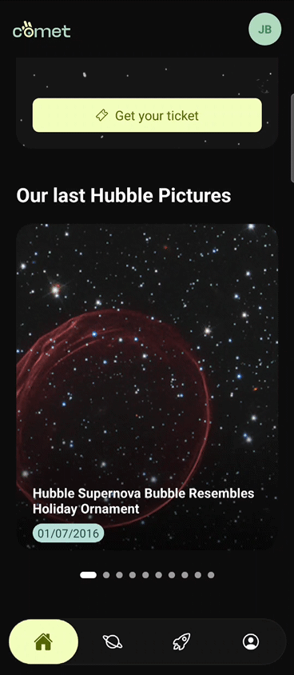
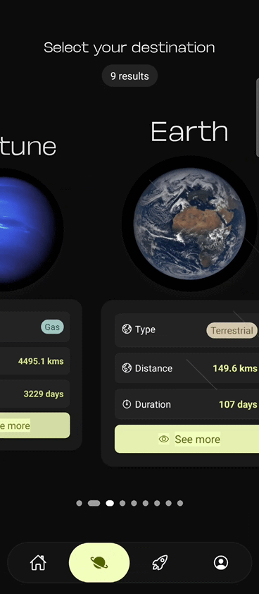
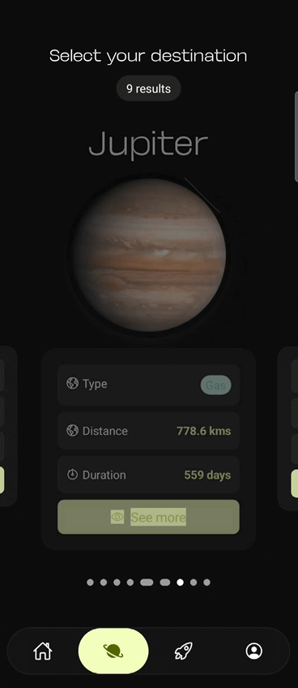

# Comet : React Native App




🌠 Embarquez pour un voyage avec <mark style="background-color:hsl(139, 36.30%, 78%);color: hsl(139, 36.30%, 20%) ;padding: 1px 3px; border-radius: 3px">**Comet**</mark>, votre guide vers les étoiles et bien plus encore.
Attachez vos ceintures, et embarquez pour une expérience interplanétaire inédite. Que vous soyez simple curieux ou explorateur aguerri, Comet vous guide à travers l’espace rapidement et **REACTIVEMENT**.

## Table des matières

1. [À propos de la mission](#-1-à-propos-de-la-mission)
2. [Technologies de bord](#-2-technologies-de-bord)
3. [Fonctionnalités](#3-fonctionnalités)
4. [API](#4-api)
5. [Tester le projet](#-5-tester-le-projet)
6. [Références](#6-références)

## 🌌 1. À propos de la mission


<mark style="background-color:hsl(139, 36.30%, 78%);color: hsl(139, 36.30%, 20%) ;padding: 1px 3px; border-radius: 3px">**Objectif**</mark> : Permettre à nos utilisateurs de planifier et visualiser des voyages interplanétaires fictifs dans une interface moderne et immersive.

## 🚀 2. Technologies de bord
| Catégorie  | Technologie                                                                                                     |
| ---------- | --------------------------------------------------------------------------------------------------------------- |
| Langages parlé à bord   |                     |
| Moteur du vaisseau |         |
| Framework        |  |
| Système de navigation |                  |
|  Transmission interstellaire de données     |                     |

## 3. Fonctionnalités

### 3.1 Navigation 
Navigation fluide entre les écrans via un système de navigation


### 3.2 Écran d'accueil 

|Accueil | Hubble |
|--|--|
|Lien vers la page Planète |Carousel d'images issues du télescope spatial Hubble|




### 3.3 Page Planètes 
|Liste des planètes | Détail d'une planète |
|--|--|
| Flat List animée des planètes|Au clic sur une planète, l’utilisateur accède à une fiche détaillée contenant des informations enrichies|




## 4. API 

L’application utilise des données à partir de l’API suivante :


**Datastro** - Portail de données ouvertes sur l'astronomie 

https://www.datastro.eu/explore/?sort=explore.popularity_score

Données utilisées :
- Données système solaire : https://www.datastro.eu/explore/dataset/donnees-systeme-solaire-solar-system-data/api/?disjunctive.planete_planet&disjunctive.type_d_astre_type_of_planet&sort=-ordre_order
- Images du télescope spatial Hubble de la NASA : https://www.datastro.eu/explore/dataset/nasahubble/api/?disjunctive.album_name_tags&sort=photo_title

## 💺 5. Tester le projet 

Maintenant que vous savez tout de nous, laissez-vous guider pas à pas !🪐

### 5.1 Prérequis

- Node.js ≥ 18
- Android Studio et/ou simulateur ou appareil réel
- React Native CLI (déjà inclus dans les dépendances)

> **Note** : assurez-vous d’avoir terminé le guide [Configurer votre environnement](https://reactnative.dev/docs/set-up-your-environment) avant de continuer.

### 5.2 Installer le projet

📂 **Clônez le dépôt**

```bash
# HTTPS
git clone https://github.com/orinaya/comet-react-native-app.git

# SSH 
git clone git@github.com:orinaya/comet-react-native-app.git
```

📦 **Installez les modules**

```
yarn install
```
### 5.3 Lancer le projet 

> 💡 **À savoir**
>
> Vous pouvez exécuter l’application sur un appareil Android (via USB) ou dans un émulateur Android Studio.
>
> 📱 **Sur téléphone** : Activez le mode développeur et le débogage USB dans les options de votre appareil. Branchez-le ensuite à votre ordinateur via USB. Vous pouvez vérifier que votre appareil est connecté grâce à la commande :
> ```
> adb devices
> ```
> Si votre appareil est bien connecté :
>```
>List of devices attached
>[NUMERO]     device
>```
>
> 💻 **Sur émulateur** : Lancez un appareil virtuel depuis Android Studio > Device Manager, avant d’exécuter la commande yarn android.

▶️ **Lancer Metro**

Tout d'abord, vous devez lancer **Metro**, l’outil de build JavaScript utilisé par React Native.
Pour démarrer le serveur de développement Metro, exécutez la commande suivante à la racine du projet :

```bash
yarn start
```

▶️ **Compiler et exécuter l'application**

Avec Metro en cours d’exécution, ouvrez un nouveau terminal (ou un autre onglet) à la racine du projet, puis lancez l’une des commandes suivantes pour construire et exécuter votre application :

```bash
yarn android
```

🔐 Il vous faudra ensuite créer à la racine du projet un fichier `.env` à partir du fichier `.env.example`

```bash
cp .env.example .env
```

## 6. Références

- [React Native Website](https://reactnative.dev) - Pour en savoir plus sur React Native.
- [React Navigation](https://reactnavigation.org/docs/getting-started/) - Documentation Navigation React Native
- [React Native Animated](https://reactnative.dev/docs/animated) - Documentation Animation React Native
- [Animation Flat List](https://www.youtube.com/watch?v=wIh60UQzUKY) - Tutoriel Animation React Native
- [Datastro API](https://www.datastro.eu/explore/?sort=explore.popularity_score) - Portail de données ouvertes sur l'astronomie 


